# Integración de Compra Completa - Tienda Web

## 🎯 Problema Resuelto

Anteriormente, cuando un cliente realizaba una compra en la tienda web:
- ❌ No se registraba en la tabla `ventas`
- ❌ No se registraba en la tabla `detalle_ventas`
- ❌ No se generaba una factura automáticamente
- ❌ No se creaba un pedido para que el vendedor lo prepare

## ✅ Solución Implementada

### 1. **Nuevo Controlador Integrado**
- **Archivo:** `backend_definitivo/src/controllers/CompraIntegradaController.ts`
- **Funcionalidad:** Procesa una compra completa en una sola transacción
- **Endpoints:**
  - `POST /api/compra-integrada/procesar` - Procesar compra completa
  - `GET /api/compra-integrada/cliente/:id` - Obtener compras del cliente

### 2. **Flujo de Compra Integrada**

Cuando un cliente completa una compra en la tienda web, el sistema automáticamente:

#### **Paso 1: Crear Venta**
```sql
INSERT INTO ventas (fecha_venta, total, metodo_pago, cliente_id, empleado_id, estado)
VALUES (NOW(), 97.48, 'transferencia', 1, 1, 'completada');
```

#### **Paso 2: Crear Detalles de Venta**
```sql
INSERT INTO detalle_ventas (id_venta, id_producto, cantidad, precio_unitario, subtotal)
VALUES (1, 1, 2, 25.99, 51.98), (1, 2, 1, 45.50, 45.50);
```

#### **Paso 3: Generar Factura**
```sql
INSERT INTO facturas (numeroFactura, fecha, total, cliente_id, estado, metodo_pago)
VALUES ('F2025010001', NOW(), 97.48, 1, 'activa', 'transferencia');
```

#### **Paso 4: Crear Detalles de Factura**
```sql
INSERT INTO detalle_facturas (factura_id, producto_id, cantidad, precio_unitario, subtotal)
VALUES (1, 1, 2, 25.99, 51.98), (1, 2, 1, 45.50, 45.50);
```

#### **Paso 5: Crear Pedido para Vendedor**
```sql
INSERT INTO pedidos (id_cliente, id_empleados, fecha_pedido, importe, estado, venta_web, payment_id)
VALUES (1, 1, NOW(), 97.48, 'pendiente', true, 'PAY-1234567890-abc123');
```

#### **Paso 6: Crear Detalles del Pedido**
```sql
INSERT INTO detalle_pedidos (id_pedido, id_producto, cantidad, precio_venta)
VALUES (1, 1, 2, 25.99), (1, 2, 1, 45.50);
```

#### **Paso 7: Actualizar Stock**
```sql
UPDATE productos SET stock = stock - cantidad WHERE id_producto IN (1, 2);
```

### 3. **Servicio Frontend**
- **Archivo:** `tienda-ropa/src/services/compraIntegradaService.ts`
- **Funcionalidad:** Comunicación con el backend para procesar compras
- **Métodos:**
  - `procesarCompra()` - Envía compra al backend
  - `obtenerComprasCliente()` - Obtiene historial del cliente

### 4. **Componente Actualizado**
- **Archivo:** `tienda-ropa/src/components/CheckoutModal.tsx`
- **Cambios:** Ahora usa el servicio integrado en lugar de solo crear pedidos

## 🔄 Flujo Completo

```mermaid
graph TD
    A[Cliente completa compra] --> B[CheckoutModal]
    B --> C[Crear/Buscar Cliente]
    C --> D[compraIntegradaService.procesarCompra]
    D --> E[Backend: CompraIntegradaController]
    E --> F[Crear Venta]
    E --> G[Crear Detalles Venta]
    E --> H[Generar Factura]
    E --> I[Crear Detalles Factura]
    E --> J[Crear Pedido]
    E --> K[Crear Detalles Pedido]
    E --> L[Actualizar Stock]
    F --> M[Respuesta Completa]
    G --> M
    H --> M
    I --> M
    J --> M
    K --> M
    L --> M
    M --> N[Mostrar Confirmación]
    N --> O[Vendedor ve pedido en panel]
```



## 📊 Beneficios

### **Para el Cliente:**
- ✅ Recibe número de factura inmediatamente
- ✅ Puede ver su historial de compras
- ✅ Factura generada automáticamente
- ✅ Pedido se prepara automáticamente

### **Para el Vendedor:**
- ✅ Ve todos los pedidos web en el panel administrativo
- ✅ Puede preparar y entregar pedidos
- ✅ Control total del inventario
- ✅ Seguimiento completo de ventas

### **Para el Negocio:**
- ✅ Registro completo de todas las transacciones
- ✅ Facturación automática
- ✅ Control de stock en tiempo real
- ✅ Reportes y estadísticas completas
- ✅ Trazabilidad total de ventas

## 🧪 Pruebas

### **Script de Prueba**
```bash
node test-compra-integrada.mjs
```

### **Prueba Manual**
1. Ir a la tienda web
2. Agregar productos al carrito
3. Completar checkout
4. Verificar en el panel administrativo:
   - Pedido aparece en la lista
   - Venta registrada en estadísticas
   - Factura generada
   - Stock actualizado

## 📁 Archivos Modificados/Creados

### **Backend:**
- ✅ `src/controllers/CompraIntegradaController.ts` (NUEVO)
- ✅ `src/router/RouterCompraIntegrada.ts` (NUEVO)
- ✅ `src/server.ts` (ACTUALIZADO)

### **Frontend:**
- ✅ `src/services/compraIntegradaService.ts` (NUEVO)
- ✅ `src/components/CheckoutModal.tsx` (ACTUALIZADO)

### **Pruebas:**
- ✅ `test-compra-integrada.mjs` (NUEVO)

## 🚀 Cómo Usar

### **1. Iniciar Backend**
```bash
cd backend_definitivo
npm run dev
```

### **2. Iniciar Frontend**
```bash
cd tienda-ropa
npm run dev
```

### **3. Probar Compra**
1. Ir a `http://localhost:5173`
2. Agregar productos al carrito
3. Hacer clic en "Finalizar Compra"
4. Completar datos del cliente
5. Confirmar compra

### **4. Verificar Resultados**
1. Ir al panel administrativo
2. Verificar que aparece el pedido
3. Verificar ventas y facturas
4. Verificar que el stock se actualizó

## 🔧 Configuración

### **Variables de Entorno**
Asegúrate de que el backend esté configurado correctamente:
- Puerto: 3001
- Base de datos: SQLite
- CORS habilitado para el frontend

### **Dependencias**
- Backend: Express, Sequelize, SQLite
- Frontend: React, TypeScript, Axios

## 📈 Próximos Pasos

1. **Notificaciones:** Enviar email de confirmación al cliente
2. **Pagos:** Integrar con pasarelas de pago reales
3. **Inventario:** Alertas de stock bajo
4. **Reportes:** Dashboard con métricas en tiempo real
5. **Mobile:** App móvil para vendedores

## 🐛 Solución de Problemas

### **Error: "Cliente no encontrado"**
- Verificar que el cliente existe en la base de datos
- Revisar el ID del cliente en la petición

### **Error: "Stock insuficiente"**
- Verificar que los productos tienen stock suficiente
- Revisar la cantidad solicitada vs disponible

### **Error: "Producto no encontrado"**
- Verificar que los productos existen en la base de datos
- Revisar los IDs de productos en la petición

### **Error de conexión**
- Verificar que el backend esté ejecutándose
- Revisar la URL de la API en el frontend
- Verificar CORS en el backend


