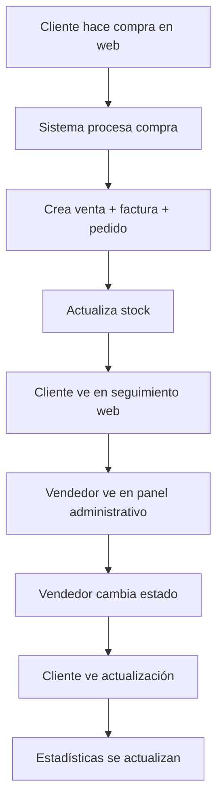

# Tests del Sistema de Pedidos

## 🧪 Tests Disponibles

### **1. Test Completo del Sistema**
```bash
node test-completo-sistema.mjs
```
**Descripción:** Ejecuta todos los tests en secuencia
**Incluye:** Flujo completo + Seguimiento web + Panel administrativo

### **2. Test de Flujo Completo**
```bash
node test-flujo-completo-pedidos.mjs
```
**Descripción:** Simula compra desde web y verifica todo el flujo
**Incluye:**
- ✅ Crear cliente
- ✅ Procesar compra desde web
- ✅ Verificar en seguimiento web
- ✅ Verificar en panel administrativo
- ✅ Cambiar estados desde panel
- ✅ Verificar actualizaciones en tiempo real

### **3. Test de Seguimiento Web**
```bash
node test-seguimiento-web.mjs
```
**Descripción:** Simula funcionalidad de seguimiento para clientes
**Incluye:**
- ✅ Búsqueda por teléfono
- ✅ Búsqueda por ID de pedido
- ✅ Visualización de detalles
- ✅ Filtrado por estado
- ✅ Información del cliente

### **4. Test de Panel Administrativo**
```bash
node test-panel-administrativo.mjs
```
**Descripción:** Simula gestión de pedidos desde el panel
**Incluye:**
- ✅ Vista general de pedidos
- ✅ Separación web/panel
- ✅ Filtrado por estado
- ✅ Gestión de estados
- ✅ Estadísticas
- ✅ Búsquedas

## 🚀 Cómo Ejecutar los Tests

### **Paso 1: Iniciar el Servidor**
```bash
cd backend_definitivo
npm run dev
```

### **Paso 2: Ejecutar Tests**
```bash
# Opción 1: Test completo (recomendado)
node test-completo-sistema.mjs

# Opción 2: Tests individuales
node test-flujo-completo-pedidos.mjs
node test-seguimiento-web.mjs
node test-panel-administrativo.mjs
```

## 📋 Qué Verifica Cada Test

### **Test de Flujo Completo**
1. **Crear Cliente**
   - Busca cliente existente por teléfono
   - Si no existe, crea uno nuevo
   - Verifica datos del cliente

2. **Compra desde Web**
   - Procesa compra usando compra integrada
   - Crea venta, factura y pedido automáticamente
   - Actualiza stock de productos
   - Genera payment_id único

3. **Verificación en Seguimiento Web**
   - Busca pedidos por cliente
   - Verifica que aparece en la lista
   - Muestra detalles del pedido

4. **Verificación en Panel Administrativo**
   - Obtiene todos los pedidos
   - Filtra pedidos web
   - Muestra información completa
   - Lista productos a preparar

5. **Gestión de Estados**
   - Cambia estado a "procesando"
   - Cambia estado a "completado"
   - Cambia estado a "entregado"
   - Verifica actualizaciones en tiempo real

### **Test de Seguimiento Web**
1. **Búsqueda por Teléfono**
   - Simula búsqueda que haría un cliente
   - Muestra todos los pedidos del cliente
   - Incluye detalles de productos

2. **Búsqueda por ID**
   - Busca pedido específico por ID
   - Muestra información completa
   - Incluye datos del cliente

3. **Filtrado por Estado**
   - Muestra pedidos por estado
   - Estadísticas de estados
   - Resumen de seguimiento

### **Test de Panel Administrativo**
1. **Vista General**
   - Muestra todos los pedidos
   - Separa pedidos web vs panel
   - Información detallada de cada pedido

2. **Gestión de Estados**
   - Filtra por estado
   - Cambia estados de pedidos
   - Simula flujo completo de gestión

3. **Estadísticas**
   - Total de pedidos
   - Total de ingresos
   - Pedidos por estado
   - Pedidos por tipo

## 🔍 Datos de Prueba

### **Cliente de Prueba**
```javascript
{
    nombre: "María",
    apellido: "González",
    telefono: "1234567890",
    email: "maria@test.com",
    direccion: "Calle Test 123, Ciudad Test"
}
```

### **Compra de Prueba**
```javascript
{
    items: [
        {
            id_producto: 1,
            cantidad: 2,
            precio_unitario: 25.99,
            subtotal: 51.98,
            color: "Azul",
            talla: "M"
        },
        {
            id_producto: 2,
            cantidad: 1,
            precio_unitario: 45.50,
            subtotal: 45.50,
            color: "Rojo",
            talla: "L"
        }
    ]
}
```

## 📊 Resultados Esperados

### **Test Exitoso**
```
✅ Compra procesada exitosamente
✅ Pedido encontrado en seguimiento web
✅ Pedido encontrado en panel administrativo
✅ Estados cambiados correctamente
✅ Actualizaciones en tiempo real
✅ Estadísticas actualizadas
```

### **Test Fallido**
```
❌ Error en compra: [mensaje de error]
❌ Pedido NO encontrado en seguimiento
❌ Error al cambiar estado
```

## 🐛 Solución de Problemas

### **Error: "Servidor no disponible"**
```bash
# Verificar que el servidor esté ejecutándose
cd backend_definitivo
npm run dev

# Verificar puerto
curl http://localhost:3001/api/health
```

### **Error: "Cliente no encontrado"**
- Verificar que existe un cliente con ID 1 en la base de datos
- O modificar el test para usar un cliente existente

### **Error: "Producto no encontrado"**
- Verificar que existen productos con ID 1 y 2
- O modificar el test para usar productos existentes

### **Error: "Stock insuficiente"**
- Verificar que los productos tienen stock suficiente
- O modificar las cantidades en el test

## 📈 Interpretación de Resultados

### **Flujo Completo Exitoso**
- ✅ Cliente creado/buscado
- ✅ Compra procesada
- ✅ Venta registrada
- ✅ Factura generada
- ✅ Pedido creado
- ✅ Visible en seguimiento web
- ✅ Visible en panel administrativo
- ✅ Estados funcionando
- ✅ Actualizaciones en tiempo real

### **Seguimiento Web Exitoso**
- ✅ Búsqueda por teléfono funciona
- ✅ Búsqueda por ID funciona
- ✅ Detalles completos mostrados
- ✅ Filtros por estado funcionan

### **Panel Administrativo Exitoso**
- ✅ Vista general funciona
- ✅ Separación web/panel correcta
- ✅ Filtros por estado funcionan
- ✅ Gestión de estados funciona
- ✅ Estadísticas actualizadas

## 🎯 Casos de Uso Cubiertos

### **Para Clientes (Web)**
1. Hacer compra en tienda web
2. Recibir confirmación con número de factura
3. Buscar pedido por teléfono
4. Ver estado del pedido
5. Ver detalles de productos
6. Seguir actualizaciones en tiempo real

### **Para Vendedores (Panel)**
1. Ver todos los pedidos
2. Filtrar pedidos web vs panel
3. Ver detalles completos de pedidos
4. Cambiar estados de pedidos
5. Ver estadísticas del negocio
6. Buscar pedidos por cliente

### **Para el Sistema**
1. Registrar ventas automáticamente
2. Generar facturas automáticamente
3. Crear pedidos para vendedores
4. Actualizar stock automáticamente
5. Mantener estadísticas actualizadas
6. Sincronizar datos en tiempo real

## 🔄 Flujo de Trabajo Completo



## 📝 Notas Importantes

1. **Base de Datos:** Los tests asumen que existen productos con ID 1 y 2
2. **Cliente:** Los tests crean un cliente de prueba si no existe
3. **Servidor:** Debe estar ejecutándose en puerto 3001
4. **Datos:** Los tests no modifican datos existentes, solo crean nuevos
5. **Limpieza:** Los tests pueden crear datos de prueba que se pueden limpiar manualmente

## 🎉 Conclusión

Estos tests verifican que todo el sistema de pedidos funciona correctamente:
- ✅ Compra desde web
- ✅ Seguimiento para clientes
- ✅ Gestión para vendedores
- ✅ Sincronización en tiempo real
- ✅ Estadísticas consolidadas

¡El sistema está listo para usar en producción! 🚀


