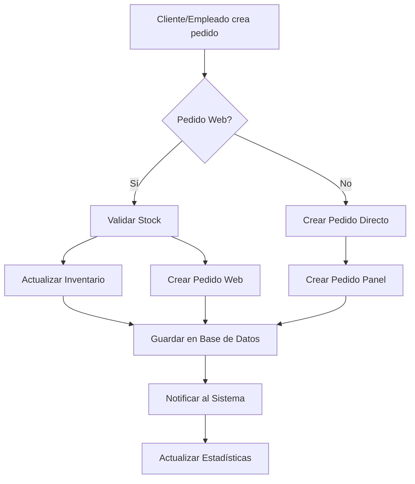

# Unificación de Controladores de Pedidos

## 🎯 Problema Identificado

Anteriormente existían **dos controladores separados** para manejar pedidos:
- `PedidosController.ts` - Para pedidos del panel administrativo
- `PedidosWebController.ts` - Para pedidos de la tienda web

Esto creaba **duplicación de código** y **complejidad innecesaria**, ya que ambos manejaban la misma entidad: **pedidos**.

## ✅ Solución Implementada

### **1. Controlador Unificado**
- **Archivo:** `backend_definitivo/src/controllers/PedidosUnificadoController.ts`
- **Funcionalidad:** Maneja todos los tipos de pedidos en un solo lugar
- **Características:**
  - ✅ Crear pedidos (web y panel administrativo)
  - ✅ Obtener pedidos con filtros opcionales
  - ✅ Cambiar estados de pedidos
  - ✅ Anular pedidos
  - ✅ Sincronizar múltiples pedidos
  - ✅ Estadísticas consolidadas

### **2. Rutas Unificadas**
- **Archivo:** `backend_definitivo/src/router/RouterPedidosUnificado.ts`
- **Endpoint base:** `/api/pedidos`
- **Endpoints disponibles:**
  - `POST /api/pedidos` - Crear pedido
  - `GET /api/pedidos` - Obtener pedidos (con filtros)
  - `GET /api/pedidos/estadisticas` - Estadísticas
  - `GET /api/pedidos/:id` - Obtener pedido por ID
  - `PUT /api/pedidos/:id/estado` - Cambiar estado
  - `PUT /api/pedidos/:id/anular` - Anular pedido
  - `POST /api/pedidos/sync` - Sincronizar pedidos

### **3. Filtros Inteligentes**
El endpoint `GET /api/pedidos` ahora soporta filtros:
- `?venta_web=true` - Solo pedidos web
- `?venta_web=false` - Solo pedidos del panel
- `?estado=pendiente` - Solo pedidos en estado específico
- `?cliente_id=1` - Solo pedidos de un cliente

## 🔄 Diferencias Clave

### **Pedidos Web (`venta_web: true`)**
- ✅ **Validación de stock** antes de crear
- ✅ **Actualización automática** del inventario
- ✅ **Payment ID** único para tracking
- ✅ **Empleado por defecto** (sistema)

### **Pedidos Panel (`venta_web: false`)**
- ❌ **Sin validación de stock** (se asume que el vendedor verifica)
- ❌ **Sin actualización de inventario** (se hace manualmente)
- ✅ **Empleado específico** que crea el pedido
- ✅ **Estados más detallados** (pendiente, procesando, completado, entregado)

## 📊 Estructura de Datos Unificada

```typescript
interface PedidoCreate {
    id_cliente: number;           // Requerido
    id_empleados?: number;        // Opcional (default: 1)
    fecha_pedido?: string;        // Opcional (default: ahora)
    importe: number;              // Requerido
    estado?: string;              // Opcional (default: 'pendiente')
    payment_id?: string;          // Opcional (para pedidos web)
    venta_web?: boolean;          // Opcional (default: false)
    productos: {                  // Requerido
        id_producto: number;
        cantidad: number;
        precio_venta: number;
        descuento?: number;
    }[];
}
```

## 🚀 Beneficios de la Unificación

### **Para Desarrolladores:**
- ✅ **Un solo lugar** para mantener la lógica de pedidos
- ✅ **Menos duplicación** de código
- ✅ **API consistente** para todos los tipos de pedidos
- ✅ **Filtros flexibles** para diferentes casos de uso

### **Para el Negocio:**
- ✅ **Vista unificada** de todos los pedidos
- ✅ **Estadísticas consolidadas** (web + panel)
- ✅ **Gestión de estados** centralizada
- ✅ **Trazabilidad completa** de pedidos

### **Para el Sistema:**
- ✅ **Menos endpoints** que mantener
- ✅ **Validación consistente** de datos
- ✅ **Manejo de errores** unificado
- ✅ **Logs centralizados**

## 🔧 Migración Realizada

### **Archivos Eliminados:**
- ❌ `PedidosController.ts` (reemplazado)
- ❌ `PedidosWebController.ts` (reemplazado)
- ❌ `RouterPedidos.ts` (reemplazado)
- ❌ `RouterPedidosWeb.ts` (reemplazado)

### **Archivos Creados:**
- ✅ `PedidosUnificadoController.ts`
- ✅ `RouterPedidosUnificado.ts`

### **Archivos Actualizados:**
- ✅ `server.ts` - Rutas unificadas
- ✅ `CompraIntegradaController.ts` - Compatible con nuevo sistema

## 🧪 Pruebas

### **Script de Prueba**
```bash
node test-pedidos-unificados.mjs
```

### **Casos de Prueba:**
1. ✅ Crear pedido web
2. ✅ Crear pedido del panel
3. ✅ Obtener todos los pedidos
4. ✅ Filtrar por tipo de pedido
5. ✅ Cambiar estado de pedido
6. ✅ Obtener estadísticas
7. ✅ Anular pedido

## 📈 Uso en el Frontend

### **Panel Administrativo:**
```javascript
// Obtener todos los pedidos
const pedidos = await fetch('/api/pedidos');

// Obtener solo pedidos web
const pedidosWeb = await fetch('/api/pedidos?venta_web=true');

// Obtener solo pedidos del panel
const pedidosPanel = await fetch('/api/pedidos?venta_web=false');

// Cambiar estado
await fetch('/api/pedidos/123/estado', {
    method: 'PUT',
    body: JSON.stringify({ estado: 'procesando' })
});
```

### **Tienda Web:**
```javascript
// Crear pedido web
const pedido = await fetch('/api/pedidos', {
    method: 'POST',
    body: JSON.stringify({
        id_cliente: 1,
        importe: 100.00,
        venta_web: true,
        payment_id: 'PAY-123',
        productos: [...]
    })
});
```

## 🔄 Flujo de Trabajo Unificado



## 🎯 Próximos Pasos

1. **Notificaciones:** Sistema de notificaciones para cambios de estado
2. **Dashboard:** Vista unificada en el panel administrativo
3. **Reportes:** Reportes consolidados de pedidos
4. **API Docs:** Documentación completa de la API unificada
5. **Testing:** Suite de pruebas automatizadas

## 🐛 Solución de Problemas

### **Error: "Pedido no encontrado"**
- Verificar que el ID del pedido existe
- Revisar que el pedido no esté anulado

### **Error: "Estado inválido"**
- Usar solo estados válidos: pendiente, procesando, completado, entregado, cancelado, anulado

### **Error: "Stock insuficiente"**
- Solo aplica a pedidos web (`venta_web: true`)
- Verificar que los productos tengan stock suficiente

### **Error de filtros**
- Usar parámetros válidos: `venta_web`, `estado`, `cliente_id`
- Verificar formato de fechas en filtros de estadísticas

## 📚 Documentación de API

### **Crear Pedido**
```http
POST /api/pedidos
Content-Type: application/json

{
    "id_cliente": 1,
    "importe": 100.00,
    "venta_web": true,
    "productos": [
        {
            "id_producto": 1,
            "cantidad": 2,
            "precio_venta": 25.99
        }
    ]
}
```

### **Obtener Pedidos con Filtros**
```http
GET /api/pedidos?venta_web=true&estado=pendiente
```

### **Cambiar Estado**
```http
PUT /api/pedidos/123/estado
Content-Type: application/json

{
    "estado": "procesando"
}
```

Esta unificación simplifica significativamente la arquitectura del sistema y proporciona una experiencia más consistente para todos los usuarios.


